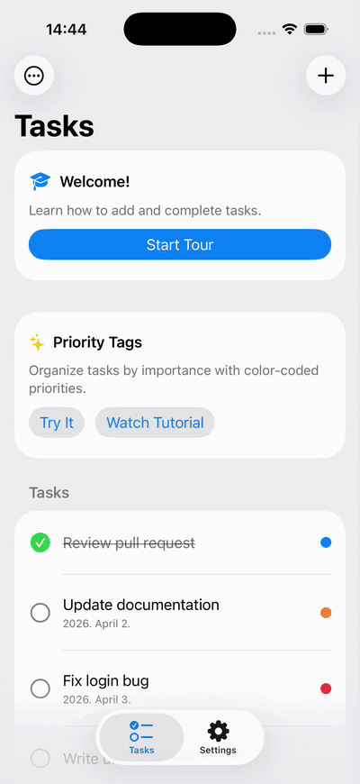
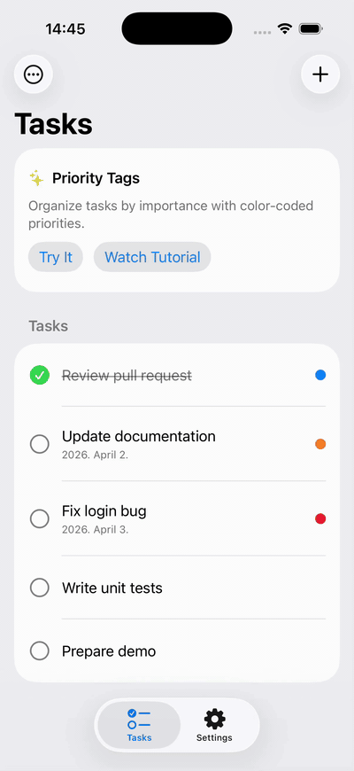

<p align="center">
  <picture>
    <source media="(prefers-color-scheme: dark)" srcset="https://raw.githubusercontent.com/mmellau/swift-beacon/main/Assets/beacon-icon-dark.svg">
    <source media="(prefers-color-scheme: light)" srcset="https://raw.githubusercontent.com/mmellau/swift-beacon/main/Assets/beacon-icon.svg">
    
  </picture>
</p>

<h1 align="center">Beacon</h1>

<p align="center">
  <strong>Spotlight overlays, coach marks and guided tours for SwiftUI</strong>
</p>

<p align="center">
  <a href="https://swiftpackageindex.com/mmellau/swift-beacon"></a>
  <a href="https://swiftpackageindex.com/mmellau/swift-beacon"></a>
  
</p>

<p align="center">
  
  
</p>

<p align="center">
  <sub>A tap-to-advance tour that follows the user into a sheet, and a timed tutorial that advances on its own. Both are screens from the <a href="Examples/BeaconDemo">demo app</a>.</sub>
</p>

Beacon dims the screen and cuts a spotlight around any SwiftUI view. Mark a view with `.beaconTarget("id")`, call `Beacon.present("id")`, and everything but the target fades back. Chain targets into steps for onboarding walkthroughs, attach tooltips to the cutouts, and `await` the user's response.

The overlay lives in its own window, so it works on top of sheets, popovers, alerts and navigation stacks without touching your view hierarchy. Where TipKit shows a tip next to a view, Beacon spotlights the view itself.

## Features

- One modifier marks a target, one call presents it
- Guided tours from a result builder, with next, previous and go-to-step control
- Tooltips: any SwiftUI view attached to a cutout, placed with a native `Alignment`
- Circle, capsule, rounded rectangle and ellipse cutouts that morph between steps
- Overlay color, opacity and animation presets, each overridable
- Works across sheets, popovers, alerts and navigation stacks
- `async`/`await` for tap results and tour completion
- VoiceOver: modal overlay, step announcements, focus restoration
- Missing targets log a warning instead of crashing; optional `os.Logger` output
- Swift 6 strict concurrency, no dependencies

## Requirements

- iOS 18.4+
- Swift 6.2+ (Xcode 26+)

## Installation

In Xcode, choose **File › Add Package Dependencies** and enter `https://github.com/mmellau/swift-beacon`. Or add it to `Package.swift`:

```swift
dependencies: [
    .package(url: "https://github.com/mmellau/swift-beacon", from: "0.3.0")
]
```

## Quick start

### 1. Mark a target

```swift
import Beacon

Image(systemName: "star")
    .beaconTarget("star")
```

### 2. Present the spotlight

```swift
Beacon.present("star")

// Several cutouts at once
Beacon.present("inbox", "compose", "settings")
```

Tapping the cutout or the dimmed area dismisses the overlay. `Beacon.dismiss()` closes it from code.

### 3. Wait for the user

```swift
let result = await Beacon.presentAsync("star")

if case .tappedRegion(let id) = result {
    print("Tapped \(id)")
}
```

The result is `.tappedRegion(id)`, `.tappedOutside`, or `.dismissed` when `Beacon.dismiss()` closed the overlay.

## Tooltips

Wrap an identifier in `BeaconTarget` to attach a view to its cutout. Plain string identifiers work alongside it.

```swift
Beacon.present(
    BeaconTarget("inbox", alignment: .top, offset: CGSize(width: 0, height: -60)) {
        Label("3 new messages", systemImage: "envelope")
    },
    BeaconTarget("compose", alignment: .bottom, offset: CGSize(width: 0, height: 60)) {
        Text("Write a new message")
    },
    "settings"  // no tooltip
)
```

`alignment` is SwiftUI's own `Alignment`, so all nine positions work. Beacon positions the view against the cutout's frame the way `overlay(alignment:)` does, which puts `.top` just inside the top edge. Use `offset` to push the view clear of the cutout, roughly its own height plus a gap.

Tooltips work the same way inside a tour:

```swift
Beacon.Sequence.run {
    BeaconStep(targets: [
        BeaconTarget("star", alignment: .top, offset: CGSize(width: 0, height: -60)) {
            Text("Tap to favorite")
        }
    ])
    BeaconStep(targets: ["settings"])
}
```

## Guided tours

Steps run in order. A step ends when the user taps its cutout, and the cutout animates to the next target.

```swift
Beacon.Sequence.run {
    BeaconStep(targets: ["profile"])
    BeaconStep(targets: ["search", "filters"])  // several cutouts in one step
    BeaconStep(targets: ["settings"])
}
```

The builder accepts `if` and `for`, so steps can depend on state.

### Steps that change the screen

`tapBehavior` decides what a tap on the cutout does: `.advance` (default), `.dismiss`, or `.custom`, which runs a closure and then advances. `dimmedTapBehavior` decides whether a tap on the dimmed area is ignored (default) or ends the tour. Each step waits briefly for its targets to register, so a tour can open a sheet and continue inside it:

```swift
Beacon.Sequence.run {
    BeaconStep(
        targets: ["add-task"],
        tapBehavior: .custom { isShowingSheet = true }
    )
    BeaconStep(targets: ["title-field"])  // lives inside the sheet
    BeaconStep(
        targets: ["save-button"],
        tapBehavior: .custom { isShowingSheet = false }
    )
}
```

### Driving a tour from code

```swift
Beacon.Sequence.next()
Beacon.Sequence.previous()
Beacon.Sequence.goTo(step: 2)
Beacon.Sequence.stop()

if Beacon.Sequence.isRunning {
    print("Step \(Beacon.Sequence.currentStep + 1) of \(Beacon.Sequence.totalSteps)")
}
```

Call `next()` from a timer for a tutorial that plays on its own, as in the second recording above.

### Waiting for a tour to finish

```swift
func showOnboardingIfNeeded() async {
    guard !hasSeenOnboarding else { return }

    await Beacon.Sequence.runAsync {
        BeaconStep(targets: ["inbox"])
        BeaconStep(targets: ["compose"])
    }

    hasSeenOnboarding = true
}
```

`runAsync` returns when the tour completes, is dismissed, or its task is cancelled.

## Configuration

### Overlay style

```swift
Beacon.style = .dimmed  // default: black at 55% opacity
Beacon.style = .light   // 30%
Beacon.style = .dark    // 75%
Beacon.style = BeaconStyle(color: .indigo, opacity: 0.6)
```

### Cutout shape and padding

```swift
Image(systemName: "star")
    .beaconTarget("star")  // circle, the default

Button("Submit") { }
    .beaconTarget("submit", shape: .capsule)

RoundedRectangle(cornerRadius: 12)
    .beaconTarget("card", shape: .rectangle(cornerRadius: 12), padding: 12)
```

`.ellipse` is also available. Cutouts extend 8 points beyond the view by default; `padding` changes that.

### Animation

```swift
Beacon.animation = BeaconAnimation(
    overlayAppear: .easeOut(duration: 0.4),
    overlayDisappear: .easeIn(duration: 0.25),
    cutoutTransition: .snappy(duration: 0.3)
)

// Per step
BeaconStep(targets: ["profile"], animation: .bouncy)
```

### Accessibility

VoiceOver treats the overlay as modal: the cutout reads as "Highlighted element", the dimmed area as "Dismiss spotlight", and the escape gesture dismisses. Beacon announces each step as "Step 2 of 5" unless you supply `accessibilityDescription`. After dismissal Beacon posts a screen-change notification so VoiceOver re-evaluates focus; pass `focusRestoration: .none` to skip that.

```swift
BeaconStep(targets: ["profile"], accessibilityDescription: "Your profile. Tap to continue.")
Beacon.present("star", focusRestoration: .none)
```

### Logging and validation

A missing target never crashes; Beacon logs a warning and skips it. Give it a logger to see those warnings, and validate identifiers up front in tests or debug builds:

```swift
import os

Beacon.logger = Logger(subsystem: "com.example.app", category: "beacon")

try Beacon.validate("star", "inbox")  // throws if any identifier is unregistered

let report = Beacon.Sequence.validate {
    BeaconStep(targets: ["profile", "settings"])
}
print(report.allInvalidTargets)
```

## How it works

Presenting shows a `UIWindow` at `.alert + 1` that hosts the SwiftUI overlay, which is why it covers sheets, popovers and alerts. While nothing is presented, the window's `hitTest` returns `nil`, so touches pass straight through to your app.

The overlay is a `ZStack` of the dim color and one shape per target filled white with `.blendMode(.destinationOut)`, wrapped in a `.compositingGroup()`. The shapes erase the dim layer instead of painting over it. A cutout's frame and corner radius are plain animatable view state, so moving to the next step morphs the hole from one target to the other. Tooltips render outside the compositing group so the blend mode leaves them alone.

`.beaconTarget` reads its frame with `onGeometryChange` in the global coordinate space, debounces updates, and registers with a `@MainActor` coordinator. It unregisters on disappear, so a spotlight never points at a view that is gone. None of this needs a `PreferenceKey` or a `GeometryReader`.

A tour is one structured task that awaits each step's interaction through a checked continuation. Steps retry target lookup for half a second, which is what lets a tour continue inside a freshly presented sheet. Cancelling the task stops the tour.

## Demo app

[BeaconDemo](Examples/BeaconDemo) is a small task list app. It has a tap-to-advance onboarding tour that continues inside a sheet, a "try it" prompt awaited with `presentAsync`, and a timer-driven tutorial that calls `next()` on its own. A settings tab switches overlay styles and animations, toggles logging, and validates a sequence against the registered targets. The app needs Xcode 26 and an iOS 26 simulator.

## License

MIT. See [LICENSE](LICENSE).
